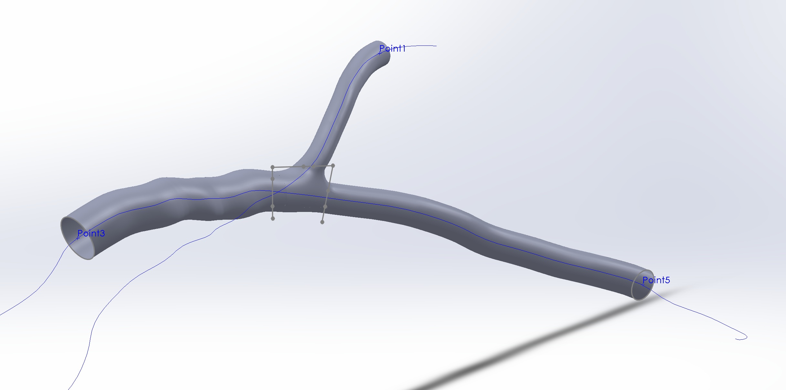

# Generating Idealized Arteries with SolidWorks, PointWise and Python for CFD in OpenFOAM

The current repository contains examples and tools for creating a pipeline
for semi-automatically generating idealised arteries (with bifurcations) from [SolidWorks](https://www.solidworks.com/) models to CFD on
the super computer using python and [PointWise](https://www.pointwise.com/).

## Contents

The following contents show how to generate your own pipeline from scratch

### Generating Arteries Without a Bifurcation

### Generating Arteries with a Bifurcation

#### [Generating a Simple Template Artery with a Bifurcation in SolidWorks](./docs/00_generating_a_ideal_artery_in_solidworks.md)

#### [Creating an Unstructured Mesh with Pointwise](./docs/01_generating_an_unsctructured_mesh_for_CFD_in_solidworks.md)

#### [Connecting to an Active Pointwise Port and Programmatically Constructing an Unstructured Mesh](./docs/02_convert_step_to_openfoam_with_pointwise_python_api.ipynb)

#### [Programmatically Creating OpenFoam Cases From a Template](./docs/03_programatically_creating_openfoam_cases_from_a_template.ipynb)

#### [Automatic Conversion of STEP Files to OpenFoam](./docs/04_automatically_convert_step_files_to_openfoam_with_an_observer.ipynb)

#### [Using Solidworks Configurations and VBA To Programmatically Generate Cases](./docs/05_using_solidworks_configurations_and_vba_to_programatically_generate_examples.md)

### Running Jobs

#### [Automatic Handling of OpenFoam Jobs on the Gadi Super Computer with Python](./docs/06_automatic_handling_of_super_computer_jobs_with_python.ipynb)

## Examples

The examples folder contains scripts for automating the process for many cases.
