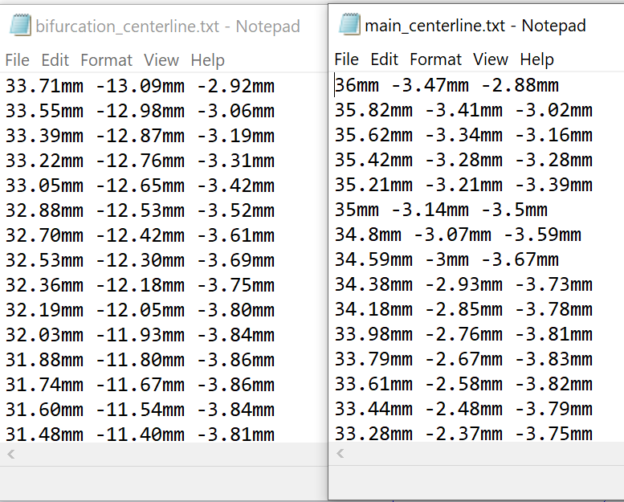
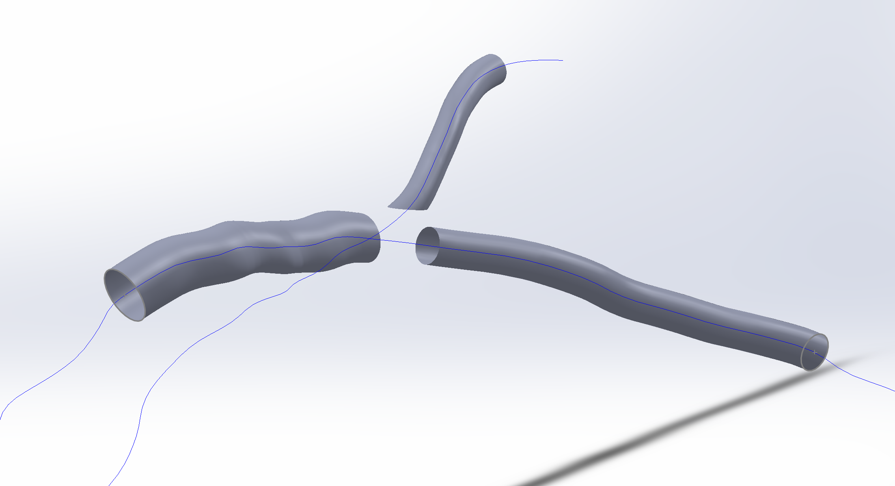
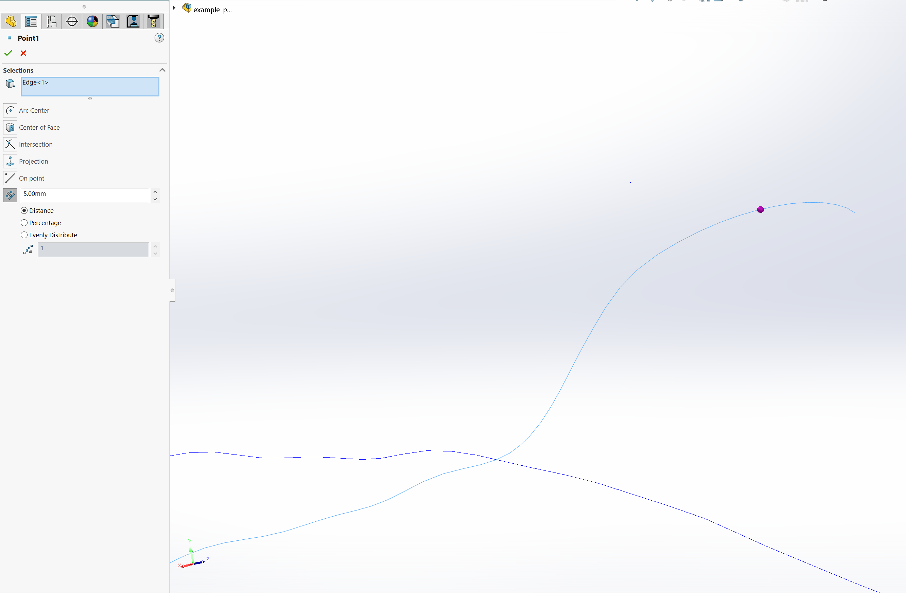
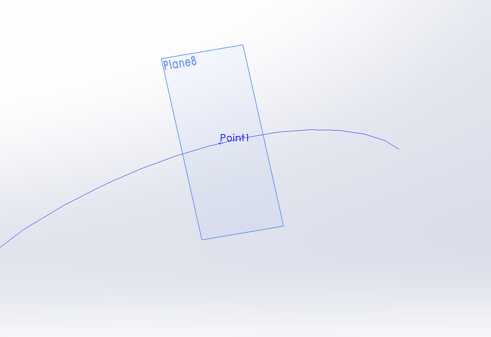
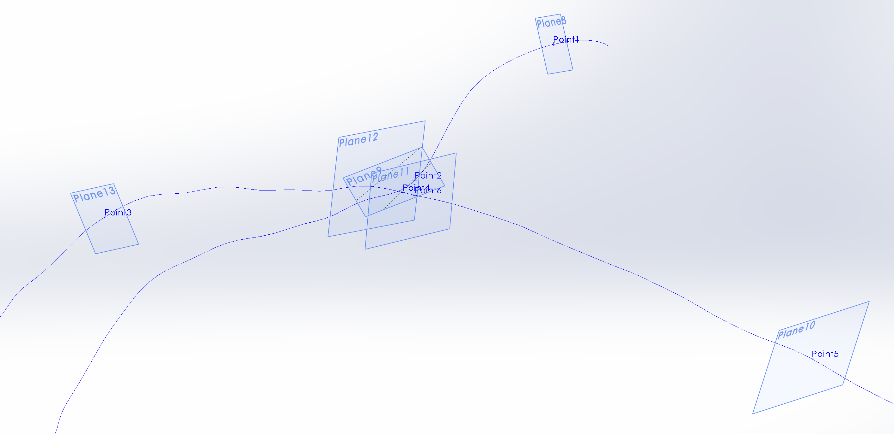

# Generating An Ideal Template Artery Using SolidWorks

In this document we will be showing students how to generate an idealized template
artery for computational fluid dynamics simulations. The resulting artery is shown
bellow.

## Step 1: Importing the Main and Bifurcation Centerlines

We shall start by importing the centerlines which describe the path of the main and
bifurcation portion of our artery. The centerlines can either be text or sldcrv
files.

We can now import the files using SolidWorks insert > Curve > curve through xyz points

## Step 2: Creating our Base Segments

The idealized artery is essentially created by joining three cylindrical segments with
a T-junction. In this section we will outline how generate the three segments
and make them easily modifiable.

### Step 2A Create Bounding Planes

To generate a segment we can define a region along a centreline bounded by two
planes. To generate the two planes we must define points coincident to our curve.
This can be done by using Surfaces > Reference Geometry > Point.

We can then modify the distance of the point along the centreline. This allows us
to easily control the length of our artery segment.

Finally, by selecting our point and the coincident curve, we can generate a plane
perpendicular to our centreline.

Now we can generate the 6 planes which describe the bounds of our three cylindrical
segments.

