# Using Solidworks Configurations and VBA to Programmatically Generate Examples

We can quickly create new examples in Solidworks by settings up a table of
configurations and exporting them programmatically with VBA.

## Creating a Design Table and Configurations in Solidworks

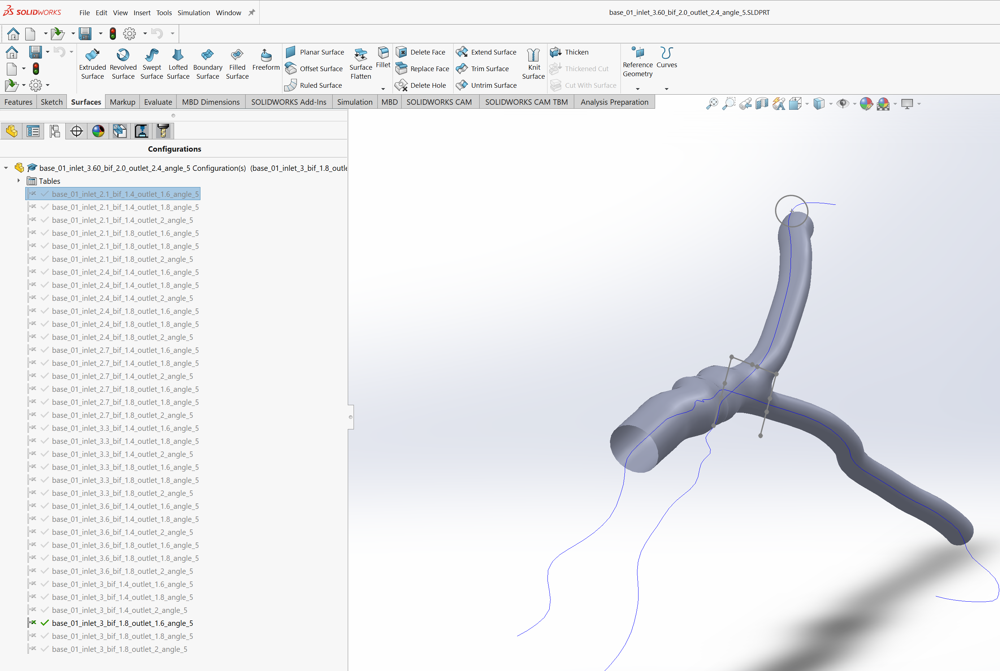

Initially we need to set some modifiable parameters for our model. For
the current cases we will set the inlet and outlet diameters as parameters.

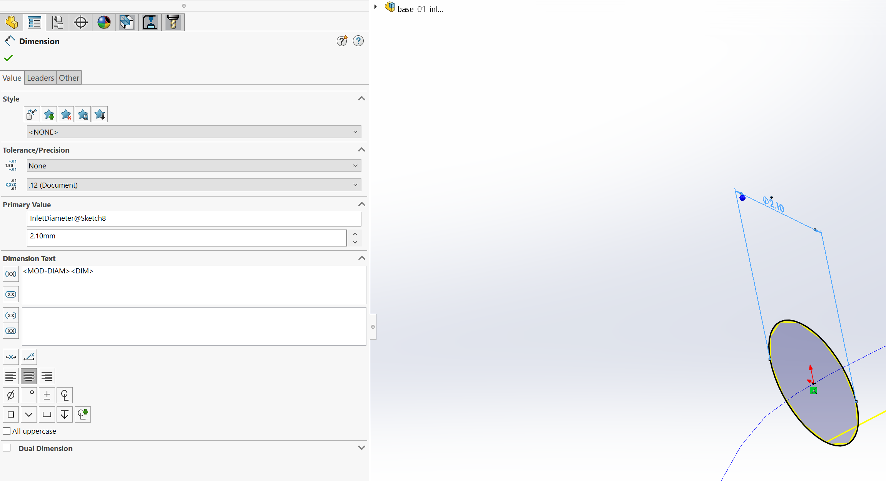

The operation shown can then also be performed for both the bifurcation and
vessel outlets.

Now let's create a design table.

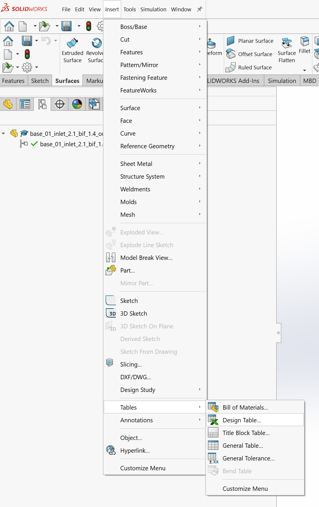

maintain the default settings,

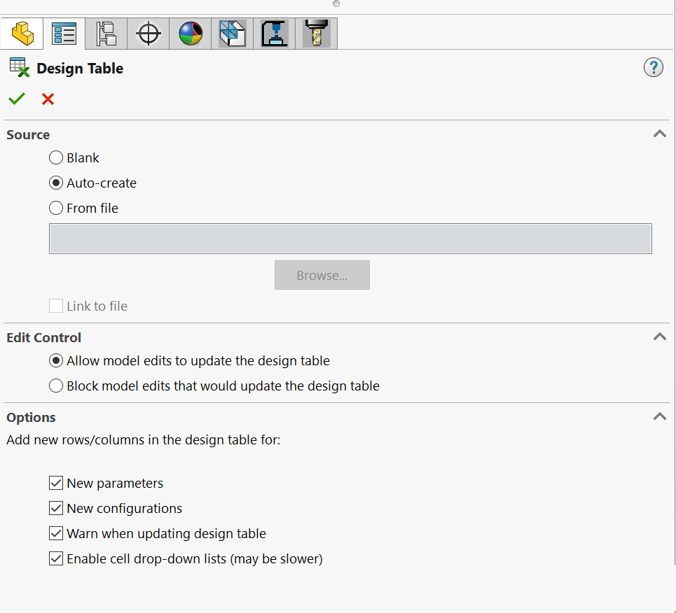

now we select the parameters to modify, we can select the inlet and
outlet parameters.

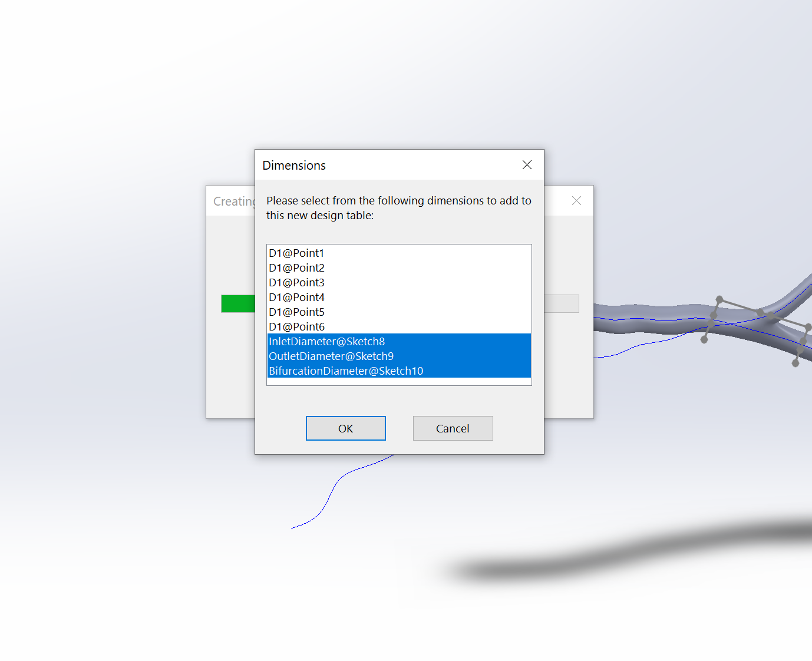

An excel will be created,

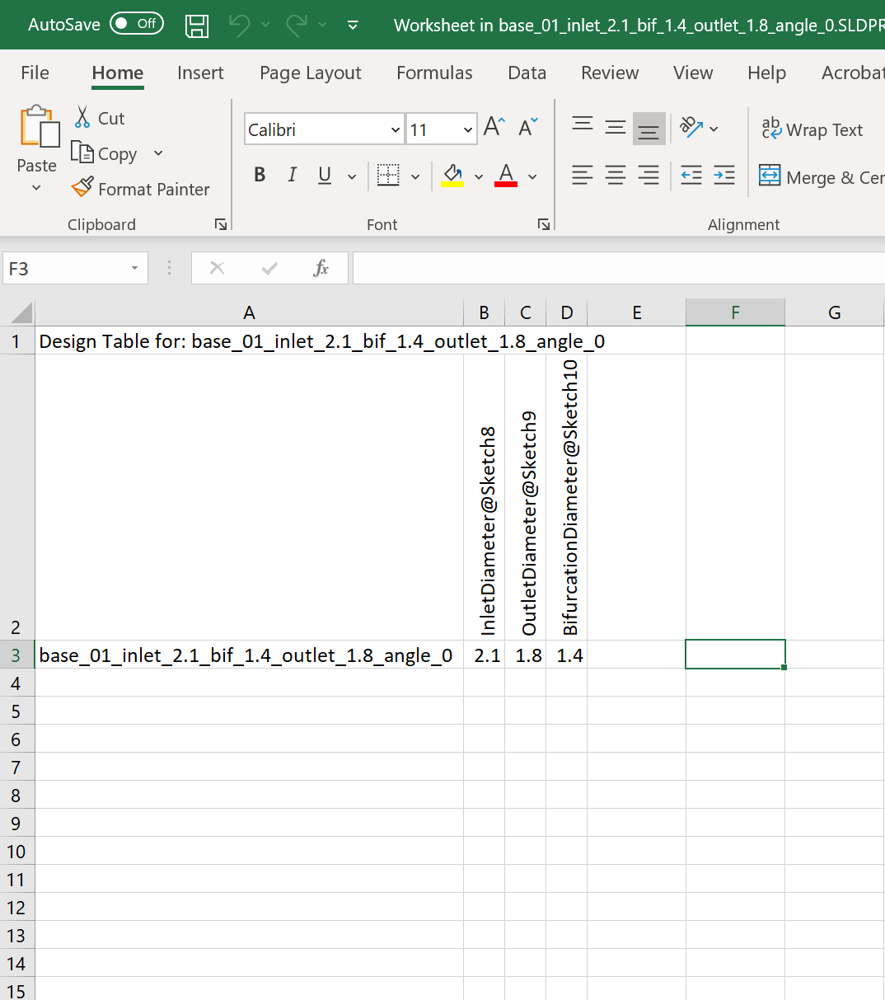

We want to be able to name the parameters accordingly, format the cells
in the first column as "General" and we can set up some name based off of
the parameters of the inlet and outlets we have specified.

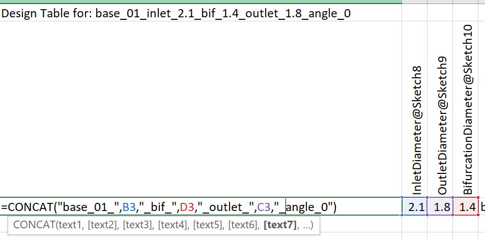

Now we can populate the design table

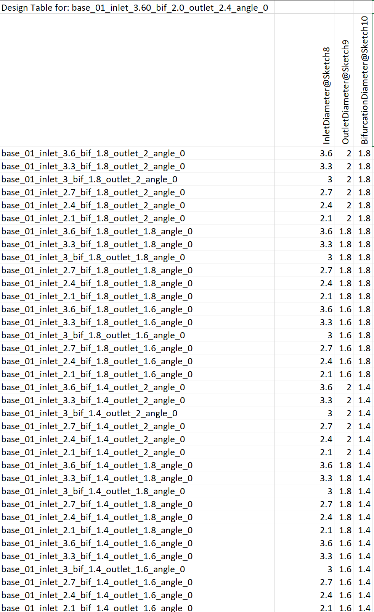

and once we close the excel the configurations will now be populated

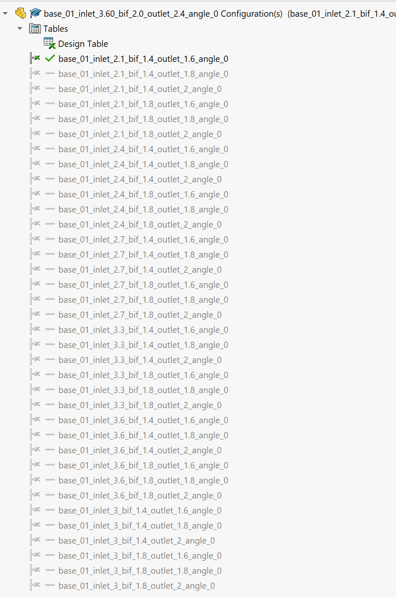

Now we only need to rebuild all the configurations and check if any of the
configurations have any errors

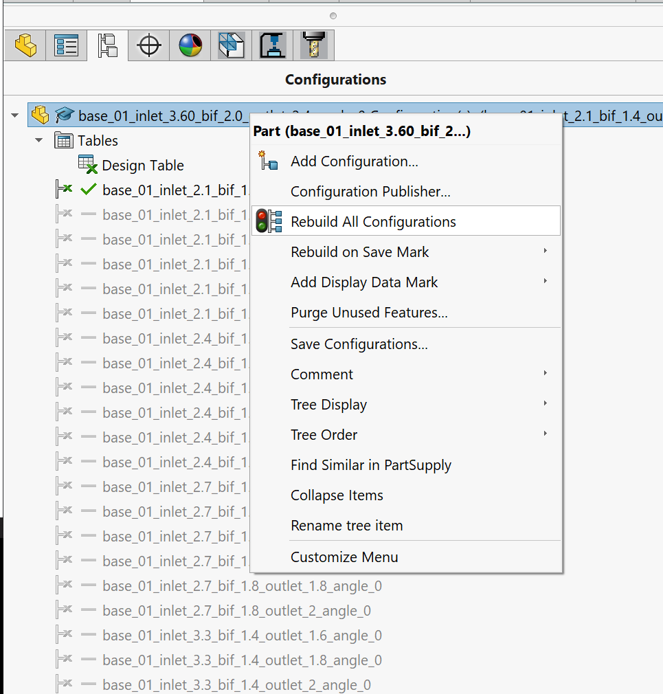

## Exporting all Files as Step Files with VBA

We can export all the files using a VBA macro, the macro we are using
is a modification of the solution to https://forum.solidworks.com/thread/108157

We first need to open the macro in Solidworks,

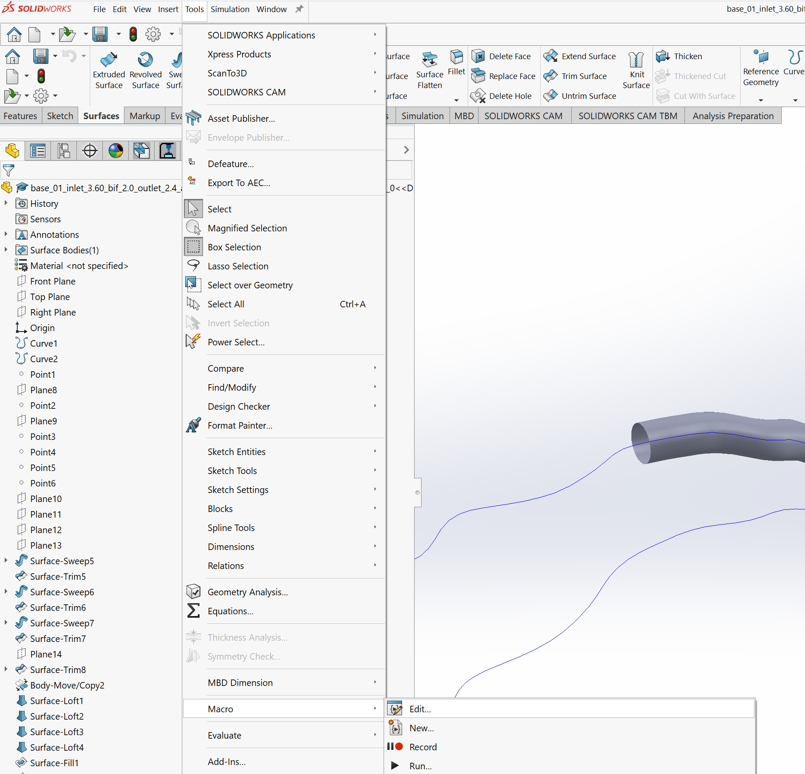

Select the export_macro.swp from the arterygen folder

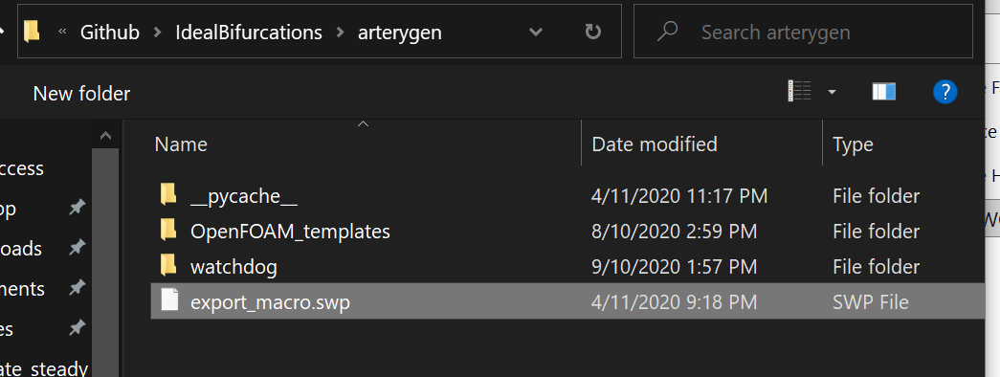

Modify the location of the .sldpart folder and the .STEP folder then run the program

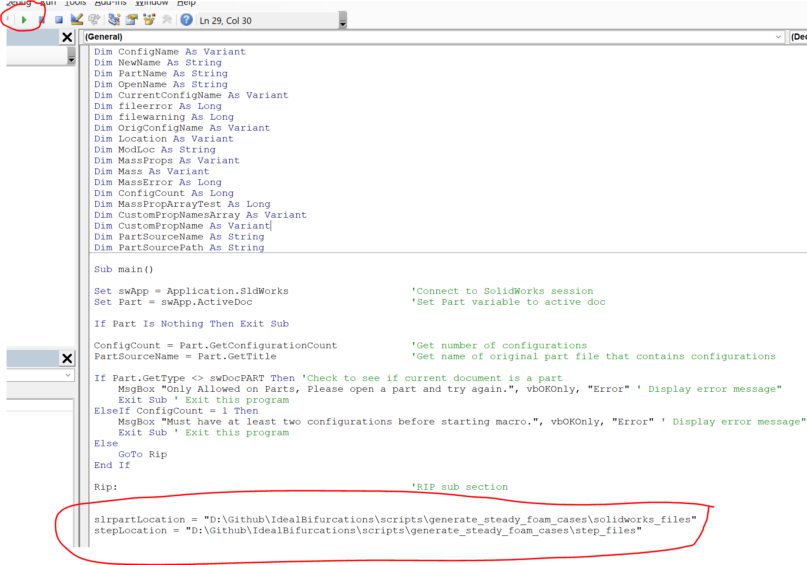